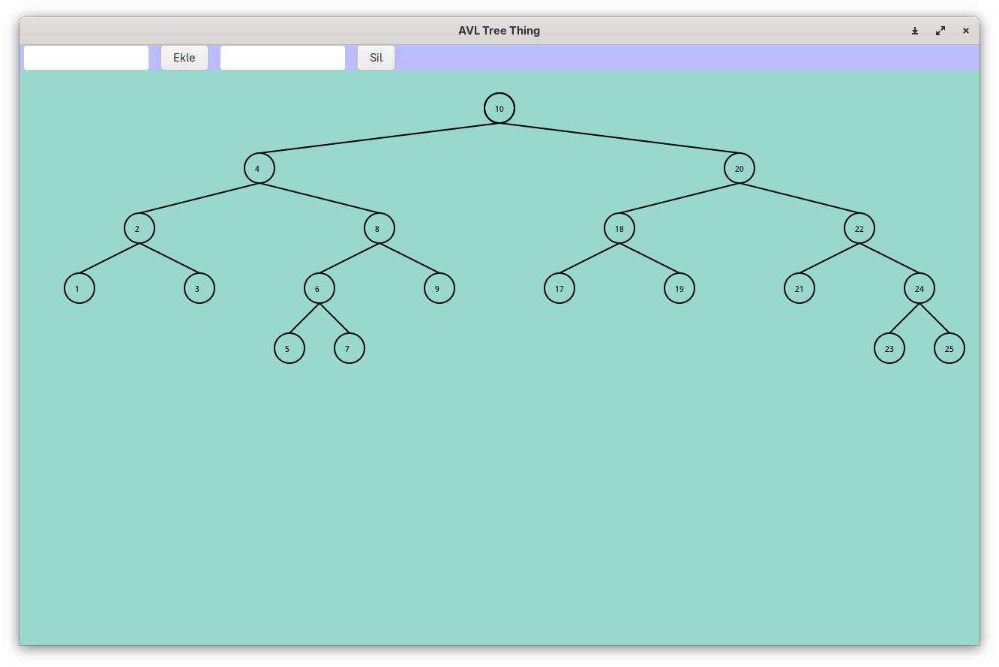

# Visualize AVL Tree

---



---


## Installation

```bash
git clone https://github.com/Esat-cpu/visualize_avl_tree
cd visualize_avl_tree
```

If you don't have the gtk3 dev lib:
### Linux
```bash
# for debian/ubuntu
sudo apt update
sudo apt install libgtk-3-dev

# for fedora
sudo dnf install gtk3-devel

# for arch
sudo pacman -S gtk3

# for void
sudo xbps-install -S gtk3-devel
```

### Windows (MSYS2)

In mingw64:
```bash
pacman -Syu
pacman -S mingw-w64-x86_64-gtk3
pacman -S mingw-w64-x86_64-make
```

---

## Compilation

```bash
make
```

### Execute:
Linux:
```bash
./build/avl
```

Windows:
```bash
.\build\avl.exe
```

